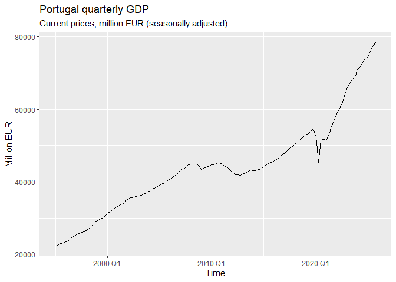
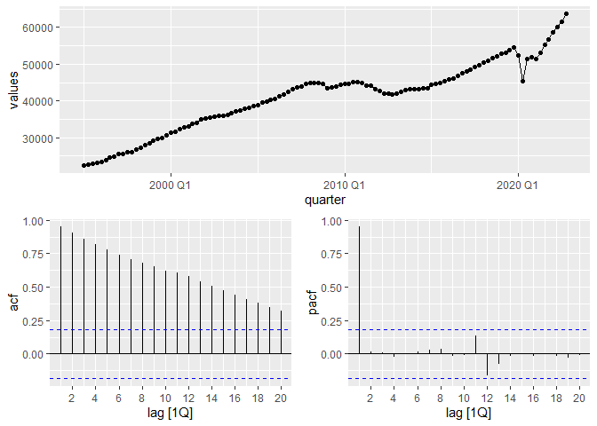
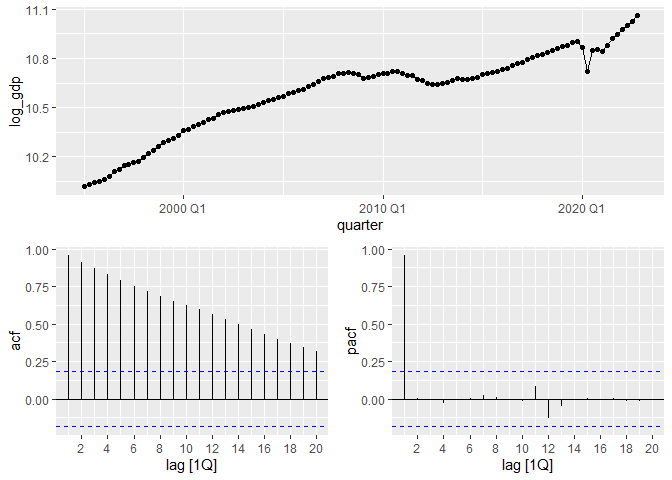
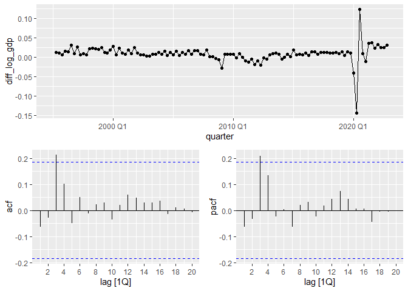
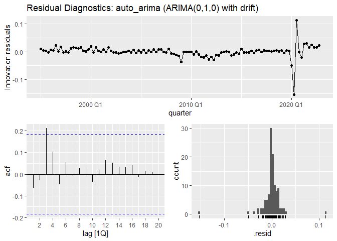
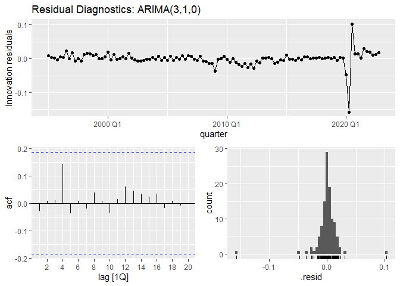
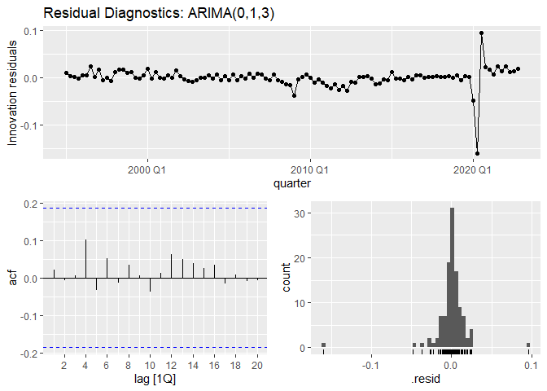
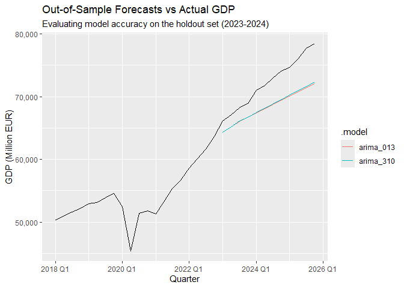
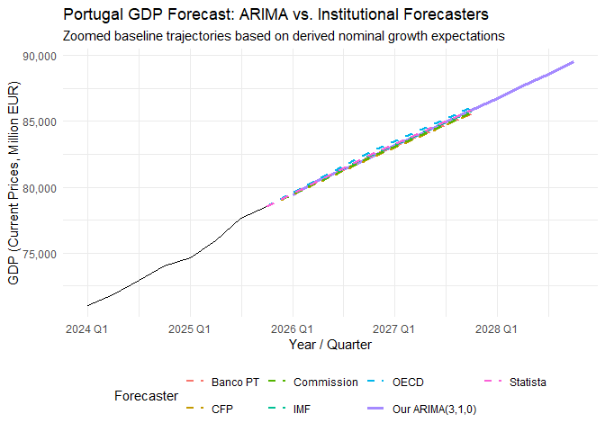
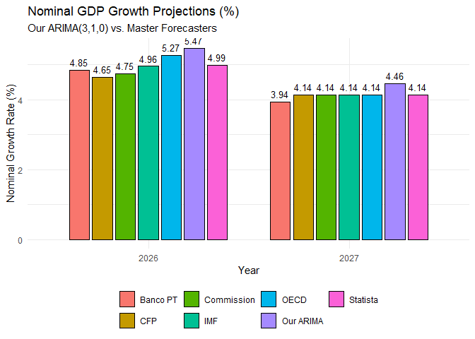

Forecasting Methods Group Project
================
Group 21 - Anna Sándorfi 20251828, Dominik Zelger 20251804, Leon Apaydın
20251814
2026-05-07

# Forecasting Methods Group Project

## GDP Forecast of Portugal

### Introduction

Portugal’s GDP offers an excellent case for time series forecasting.
Understanding and predicting it is not only important for banks,
businesses and investors, but as Erasmus students we can get to know
Portugal’s economy better.

In this project we will apply the Box-Jenkins methodology to the
Quarterly data of Portugal’s GDP, for which our source is the Eurostat’s
database. The series covers the period from 1995 Q1 to 2025 Q4,
expressed in current prices (million EUR) and is seasonally adjusted by
Eurostat. The goal is to identify an appropriate ARIMA model, validate
it through diagnostic checks, and produce a short-term forecast of
Portugal’s GDP for the coming quarters.

### 1. Visualisation

<!-- -->

From the first figure we can see that our time series has an upward
trend, with some drops, regarding a smaller one at 2008, and a larger,
sharp one at 2020 caused by COVID. This large drop could be handled by
keeping only the values before or after 2020, but none of these would be
wise decisions, since either we will have too few observations, or lose
the most recent data. Another solution would be to use a dummy variable,
but with that we would need to use ARIMAX later, which is out of the
scope of this project.

#### Splitting the data

To be able to evaluate our models performance with the data it hasn’t
seen, we split the data before and after 2022 Q4.

### 2. Box-Jenkins methodology

The next step is to use the logarithmic transformation on the dataset.
The ADF test on the log transformed series fails to reject the unit root
hypothesis, confirming non-stationarity. After first differencing, the
null is rejected, resulting in d = 1.

<!-- --><!-- -->

    ## 
    ## ############################################### 
    ## # Augmented Dickey-Fuller Test Unit Root Test # 
    ## ############################################### 
    ## 
    ## Test regression trend 
    ## 
    ## 
    ## Call:
    ## lm(formula = z.diff ~ z.lag.1 + 1 + tt + z.diff.lag)
    ## 
    ## Residuals:
    ##       Min        1Q    Median        3Q       Max 
    ## -0.155901 -0.005063  0.000960  0.006603  0.096851 
    ## 
    ## Coefficients:
    ##               Estimate Std. Error t value Pr(>|t|)  
    ## (Intercept)  0.5382389  0.2525722   2.131   0.0354 *
    ## z.lag.1     -0.0514943  0.0247752  -2.078   0.0401 *
    ## tt           0.0003052  0.0001866   1.635   0.1050  
    ## z.diff.lag  -0.0635809  0.0957063  -0.664   0.5079  
    ## ---
    ## Signif. codes:  0 '***' 0.001 '**' 0.01 '*' 0.05 '.' 0.1 ' ' 1
    ## 
    ## Residual standard error: 0.02163 on 106 degrees of freedom
    ## Multiple R-squared:  0.05005,    Adjusted R-squared:  0.02317 
    ## F-statistic: 1.862 on 3 and 106 DF,  p-value: 0.1405
    ## 
    ## 
    ## Value of test-statistic is: -2.0785 8.3289 2.5585 
    ## 
    ## Critical values for test statistics: 
    ##       1pct  5pct 10pct
    ## tau3 -3.99 -3.43 -3.13
    ## phi2  6.22  4.75  4.07
    ## phi3  8.43  6.49  5.47

    ## Warning: Removed 1 row containing missing values or values outside the scale range
    ## (`geom_line()`).

    ## Warning: Removed 1 row containing missing values or values outside the scale range
    ## (`geom_point()`).

<!-- -->

    ## 
    ## ############################################### 
    ## # Augmented Dickey-Fuller Test Unit Root Test # 
    ## ############################################### 
    ## 
    ## Test regression drift 
    ## 
    ## 
    ## Call:
    ## lm(formula = z.diff ~ z.lag.1 + 1 + z.diff.lag)
    ## 
    ## Residuals:
    ##       Min        1Q    Median        3Q       Max 
    ## -0.156496 -0.003518  0.000083  0.006266  0.101813 
    ## 
    ## Coefficients:
    ##              Estimate Std. Error t value Pr(>|t|)    
    ## (Intercept)  0.010293   0.002489   4.135 7.14e-05 ***
    ## z.lag.1     -1.101189   0.143105  -7.695 7.75e-12 ***
    ## z.diff.lag   0.033487   0.097831   0.342    0.733    
    ## ---
    ## Signif. codes:  0 '***' 0.001 '**' 0.01 '*' 0.05 '.' 0.1 ' ' 1
    ## 
    ## Residual standard error: 0.02213 on 106 degrees of freedom
    ## Multiple R-squared:  0.5307, Adjusted R-squared:  0.5218 
    ## F-statistic: 59.92 on 2 and 106 DF,  p-value: < 2.2e-16
    ## 
    ## 
    ## Value of test-statistic is: -7.695 29.613 
    ## 
    ## Critical values for test statistics: 
    ##       1pct  5pct 10pct
    ## tau2 -3.46 -2.88 -2.57
    ## phi1  6.52  4.63  3.81

### 3. Model Estimation and Selection

By analyzing the ACF and PACF plots, we identified several suitable
candidate models. Since the dataset is already seasonally adjusted by
Eurostat, we manually restrict the seasonal component (PDQ = 0,0,0) for
all models to prevent the algorithms from finding and overfitting to
seasonal noise. To decide which model to proceed with, we will first
train these models alongside an automated baseline (`auto_arima`) and
then compare their Information Criteria (AIC and BIC) values. Models
with lower information criteria indicate a better fit with less
information loss.

    ## # A tibble: 5 x 4
    ##   .model       AIC  AICc   BIC
    ##   <chr>      <dbl> <dbl> <dbl>
    ## 1 auto_arima -531. -531. -526.
    ## 2 arima_013  -532. -531. -518.
    ## 3 arima_310  -531. -530. -517.
    ## 4 arima_111  -528. -528. -517.
    ## 5 arima_313  -527. -526. -505.

At first glance, the `arima_013` and `auto_arima` models appear to be
the best choices as they have the lowest AIC and BIC scores. However, an
evaluation of their coefficients is necessary to ensure if they are
statistically valid. We also include `arima_310` as the third-best
candidate for comparison.

    ## # A tibble: 9 x 6
    ##   .model     term     estimate std.error statistic   p.value
    ##   <chr>      <chr>       <dbl>     <dbl>     <dbl>     <dbl>
    ## 1 arima_310  ar1      -0.0583    0.0929     -0.627 0.532    
    ## 2 arima_310  ar2      -0.0161    0.0929     -0.174 0.862    
    ## 3 arima_310  ar3       0.207     0.0925      2.24  0.0268   
    ## 4 arima_310  constant  0.00825   0.00200     4.13  0.0000708
    ## 5 arima_013  ma1      -0.111     0.0924     -1.21  0.231    
    ## 6 arima_013  ma2       0.0113    0.0853      0.132 0.895    
    ## 7 arima_013  ma3       0.221     0.0877      2.53  0.0130   
    ## 8 arima_013  constant  0.00949   0.00223     4.25  0.0000455
    ## 9 auto_arima constant  0.00942   0.00206     4.57  0.0000126

Examining the coefficient summary, we see that the `auto_arima` model
contains only a significant constant term.

In our other models, we observed that the first and second lags were
statistically insignificant, but the third lags (ar3 and ma3) were
significant (p\<0.05). We attribute this to the COVID crisis of 2020
disrupting short-term normal economic cycles, leading to high variance
and a sharp recovery.

Finally, we decide to proceed with residual analysis using the auto,
ARIMA(3,1,0) and ARIMA(0,1,3) models, which yield very similar p-values
and IC results.

### 4. Diagnostic Checking

Although the `auto_arima` model presents a statistically significant
constant term, its residual ACF plot reveals a significant spike
crossing the confidence bound, indicating autocorrelated errors.
Therefore, it fails the diagnostic checks.

We then focused on the ARIMA(3,1,0) and ARIMA(0,1,3) models to better
analyze the lagged economic shocks, particularly the disruptions caused
by the COVID-19 crisis. For both models, all autocorrelations in the ACF
plots fall within the 95% confidence limits. To confirm our visual
findings, a Ljung-Box test was conducted. The test returned p-values of
0.710 for ARIMA(3,1,0) and 0.861 for ARIMA(0,1,3). Since both values are
significantly higher than the 0.05 significance level, this confirms
that the errors are purely random (White Noise). Even though
ARIMA(0,1,3) has slightly betters statistics with higher Ljung-Box
p-value and lower Information Criteria scores, we are going to take both
models to see their performance metrics on forecasting.

<!-- --><!-- --><!-- -->

    ## # A tibble: 2 x 3
    ##   .model    lb_stat lb_pvalue
    ##   <chr>       <dbl>     <dbl>
    ## 1 arima_013    1.91     0.861
    ## 2 arima_310    2.93     0.710

    ## # A tibble: 1 x 3
    ##   .model     lb_stat lb_pvalue
    ##   <chr>        <dbl>     <dbl>
    ## 1 auto_arima    7.78     0.455

### 5. Out-of-Sample Evaluation

To determine the most robust model for predicting future values, we
evaluate the out-of-sample performance of both ARIMA(3,1,0) and
ARIMA(0,1,3). We use our holdout `gdp_test` dataset (2023 Q1 - 2024 Q4)
to generate an 8-quarter forecast and calculate error metrics,
particularly Root Mean Squared Error (RMSE) and Mean Absolute Percentage
Error (MAPE). We also visually inspect the forecast against the actual
historical data.

    ## # A tibble: 2 x 4
    ##   .model     RMSE   MAE  MAPE
    ##   <chr>     <dbl> <dbl> <dbl>
    ## 1 arima_310 4071. 3791.  5.15
    ## 2 arima_013 4219. 3925.  5.33

<!-- -->

The error metrics revealed that while even though ARIMA(0,1,3) had a
better in-sample fit, ARIMA(3,1,0) outperformed it in out-of-sample
testing with a lower RMSE and a MAPE of approximately 5.15%

However, the visual plot indicates that both models underpredicted the
steep trajectory of the actual GDP during 2023-2024. This divergence can
be attributed to the massive post-COVID inflation shock experienced
across Europe. Because our dataset uses Current Prices (nominal GDP),
the sharp rise in actual GDP reflects inflated price levels rather than
pure economic output. Univariate ARIMA models naturally struggle to
capture such exogenous macroeconomic shocks without external regressors.
Despite this limitation, we select **ARIMA(3,1,0)** as our final
champion due to its superior predictive accuracy on unseen data.

### 6. Final Forecast and Economic Implications (2026-2028)

Having validated ARIMA(3,1,0) as our most reliable predictive model, we
now refit it using the entire historical dataset (`gdp_tsibble`) to
maximize our information base before forecasting the next three years
(2026 Q1 - 2028 Q4).

We also derive the annual nominal GDP growth rates from our point
forecasts. This enables a direct comparison with institutional
projections from bodies like the European Commission and the IMF.

    ## [1] "Annual Nominal GDP Growth Rates:"

    ## # A tibble: 4 x 3
    ##    year annual_gdp annual_growth_pct
    ##   <dbl>      <dbl>             <dbl>
    ## 1  2025    306750.              5.85
    ## 2  2026    323525.              5.47
    ## 3  2027    337955.              4.46
    ## 4  2028    352592.              4.33

### 7. Comparison with Institutional Forecasts

To evaluate the validity and robustness of our ARIMA(3,1,0) model, we
compared its out-of-sample projections against the macroeconomic
forecasts published by leading authorities, including the European
Commission, Banco de Portugal, CFP, OECD, IMF, and Statista.

Since these institutions primarily publish *real* GDP growth
expectations, we had to compute the implied *nominal* GDP growth to make
them directly comparable with our model, which is trained on current
prices (nominal terms). To bridge this gap, we incorporated the European
Commission’s inflation projections. Specifically, we applied the
Commission’s projected inflation rates—estimated at approximately 3.0%
for 2026, and 2.3% for 2027—to the institutions’ real growth rates.

<!-- -->

The results from the graph below suggest a clear trend, the growth path
predicted by our ARIMA(3,1,0) model (trained solely on historical data)
aligns relatively well with the forecasts of international institutions
(dashed lines). It is encouraging to see that a straightforward
univariate model can produce a trajectory similar to the more complex
models used by major institutions, indicating that our forecast provides
a reasonable baseline.

<!-- -->

Looking at the annual nominal growth rates, the results are clear. For
2026, our model offers a slightly optimistic forecast of around 5.5%,
which is just above institutional expectations (4.65%–5.27%). More
interestingly, for 2027, our model reflects the general deceleration
trend expected by international authorities, with the predicted rate
adjusting to 4.47%. This suggests that the model is capable of picking
up on broader macroeconomic slowdowns, rather than just projecting a
continuous upward trend.

### 8. Conclusion

In summary, our ARIMA(3,1,0) model captures the fundamental
autoregressive dynamics of Portugal’s GDP, providing a reasonable
baseline projection for the near future. Our model demonstrated its
reliability by achieving a Mean Absolute Percentage Error (MAPE) of
approximately 5% in out-of-sample performance during the testing phase.
When we compare our results with the European Commission’s real growth
and inflation forecasts—which indicate nominal growth targets ranging
from 4.1% to 4.7% for the coming years—we observe that our model’s
outputs show a reasonable level of alignment. Although univariate time
series analysis inherently has limitations in forecasting sudden
exogenous shocks, this project highlights that the Box-Jenkins
methodology can still be effectively used as a practical and data-driven
tool for observing macroeconomic trends and establishing a basic
forecasting framework.

### References

- **Banco de Portugal.** (n.d.). *Economic Projections*. Retrieved from
  <https://www.bportugal.pt/en/page/economic-projections>

- **European Commission.** (n.d.). *Economic forecast for Portugal*.
  Retrieved from
  <https://economy-finance.ec.europa.eu/economic-surveillance-eu-member-states/country-pages/portugal/economic-forecast-portugal_en>

- **International Monetary Fund (IMF).** (n.d.). *Real GDP growth
  (Annual percent change) - Portugal*. IMF DataMapper. Retrieved from
  <https://www.imf.org/external/datamapper/NGDP_RPCH@WEO/PRT?zoom=PRT&highlight=PRT>

- **Organisation for Economic Co-operation and Development (OECD).**
  (2026). *OECD Economic Surveys: Portugal 2026*. Retrieved from
  <https://www.oecd.org/en/publications/oecd-economic-surveys-portugal-2026_025b3445-en.html>

- **Portuguese Public Finance Council (CFP).** (n.d.). *Economic and
  Fiscal Outlook 2026-2030*. Retrieved from
  <https://www.cfp.pt/en/publications/economic-and-fiscal-outlook/economic-and-fiscal-outlook-2026-2030>

- **Statista.** (n.d.). *Gross domestic product (GDP) growth rate in
  Portugal*. Retrieved from
  <https://www.statista.com/statistics/372306/gross-domestic-product-gdp-growth-rate-in-portugal/>
